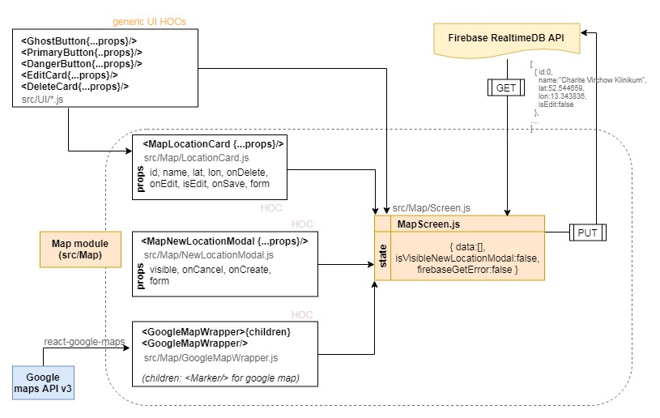

# React Map app

[](https://travis-ci.org/antekai/ct-med-map)[](https://github.com/semantic-release/semantic-release)[](https://cypress.io)

> Create, edit, delete, view map locations with react and google maps API.

## Table of Contents

- [Preview](#preview)
- [Installation](#installation)
- [User-features](#user-features)
- [Technical-features](#Technical-features)
- [Portability](#portability)
- [Support](#support)

## Preview

URL: https://react-map-app.netlify.com/


_e2e test preview (testing newLocation useflow)_

## Installation

Install [Node.js](https://nodejs.org/en/), [Git](https://git-scm.com/) and then:

```sh
git clone https://github.com/antekai/ct-med-map.git react-map-app
cd react-map-app
yarn install
yarn start
```

> Note: You have to set google map api key.

```js
// Replace gMapKey with your own key
// src/Map/GoogleMapWrapper.js
const gMapKey = `${process.env.REACT_APP_GOOGLE_MAP_API}`;
```

Testing with cypress (E2E, integration):

```sh
#you need to have open instance of application at localhost:3000 before using cypress:
#yarn start
#on another terminal instance run:
yarn cy:open
```

> End-to-End tests with cypress simulate realistic user interaction with the application. There are no stubs but real request to backend (Firebase) and Map API.

## User-features

- [x] Create, view, edit, delete map locations (React.js)
- [x] Validate user input (getFieldDecorator, regex)
- [x] View (synced) map locations with Google map api (React.js, react-google-maps)
- [x] Save/load map locations to/from a backend api (axios, firebase)

## Technical-features

  
_React-map-app architecture_

- [x] Design Considerations: Scalability, Portability, Maintainability
- [x] UI: ant-design and vanilla css (flexbox layout)
- [x] Module-based folder structure and path-based component naming
- [x] Local state management (React.js)
- [x] Type checking (prop-types)
- [x] Integration, End to end(E2E) tests (cypress.io)
- [x] Management with automated Kanban (github project)
- [x] Continuous Deployment (Netlify CD)
- [x] Continuous Integration (Travis CI)
- [x] Automated versioning (semantic-release)
- [x] Monitor bundle - report: [wba-report.html](http://htmlpreview.github.io/?https://github.com/antekai/ct-med-map/blob/master/bundleReports/wba-report.html) (webpack-bundle-analyzer)
- [ ] Unit, integration tests (jest, react-testing-library, wallaby)
- [ ] Fallback for no 3rd party map api
- [ ] Fallback/alternative map api (mapbox)
- [ ] Fallback/alternative backend api (express.js)

## Portability

The application was designed without tight coupling to backend or map APIs. Further information about switching backend or/and map APIs follows below.

### Backend

Any REST api is compatible with this application. Steps to use another API:

1. Create a new axios instance at `src/axios.js` with your configuration (baseURL, headers config)
2. Replace the GET request at `componentDidMount()` and the PUT request `putToFirebase()` method of the MapScreen component (`src/Map/Screen.js`) using the new axios instance.

### 3rd-party Map API

To change from google-maps to another 3rd-party MAP API follow the steps:

1. Create a new react-component to handle the rendering of the map based the new 3rd-party MAP API.
2. Replace `<GoogleMapWrapper/>` and `<Marker/>` references at the MapScreen (`src/Map/Screen.js`) component

```jsx
class MapScreen extends React.Component {
.....
render(){
.....
const dataToMarkers = this.state.data.map((item, i) => (
     <Marker
       key={i}
       position={{ lat: item.lat, lng: item.lon }}
       title={item.name}
     />
   ));
return (
     <div className={`flexContainer margin-1`}>
       {/*** MAP COMPONENT ***/}
       <div className="flexItem">
         {this.state.gMapError ? (
           `GoogleMapAPI error - put fallback component here`
         ) : (
           <GoogleMapWrapper>{dataToMarkers}</GoogleMapWrapper>
         )}
       </div>
       ....
       )
}}
```

## Error-handling

Error handling map-API strategy was to render fallback component based on other map-api(e.g. mapbox) in case of google-map error. Catching errors of google maps(#13) is not completed due to issues related with current implementation and CORS errors when trying to catch error with direct calls via axios(client-side) to google-map api (google doesn't allow that).

## Support

Please [open an issue](https://github.com/antekai/ct-med-map/issues/new) for support.
